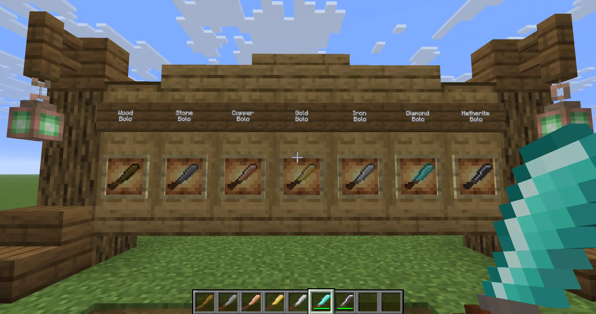
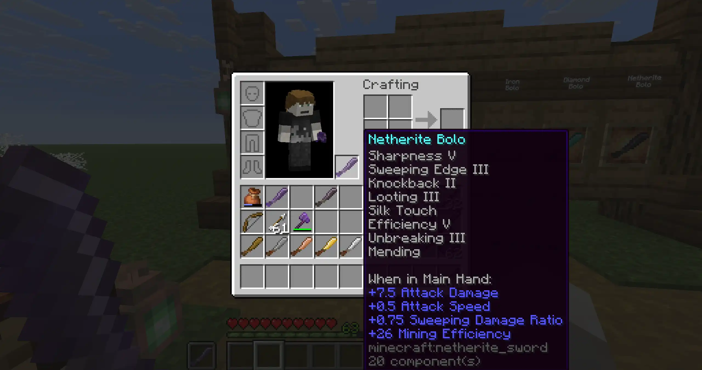
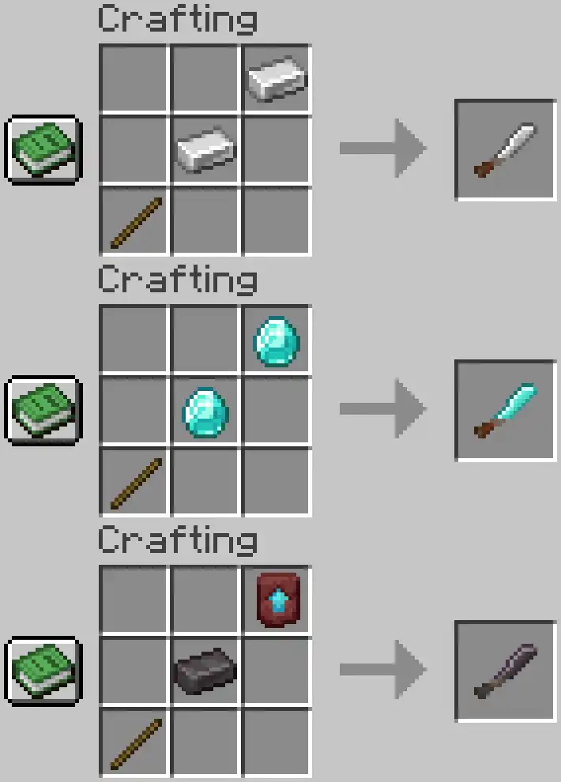

# Bolo; Sword + Axe Hybrid

A Minecraft data pack & resource pack by **ProcStack** adding the **Bolo**
 &nbsp;&nbsp; A hybrid tool/weapon mixing swords & axes.

    

## Features
Slightly weaker but faster than a sword
 Slightly slower chopping wood than an axe

- **Bolo Types**:
  - Wood, Stone, Copper, Gold, Iron, Diamond, & Netherite
- Custom crafting and smithing recipes
- Add both Sword & Axe Enchantments

## Install
Download the repo's zip by clicking to the `Code` button in the upper right, click `Download ZIP`
  Extract the zip in your `.minecraft\resourcepacks\` & `.minecraft\saves\[YOUR_WORLD_NAME]\datapacks\` directories.

Load your world
  Check your `Options > Resource Packs > Available` list for `procstack-bolo-v0.2` and click the Icon's Arrow.
  Moving `procstack-bolo-v0.2` to the `Selected` list.

Then just test the crafting recipe!

**Known Bug** -
  Using a Diamond Bolo in a Smithing Table outputs a Diamond Bolo, not a Netherite Bolo.
 Use a netherite ingot in the crafting table.
 &nbsp;&nbsp; *To be fixed shortly!*

  -Sword & Axe Enchantments-
    

  -Diagonal Materials to craft-
    

